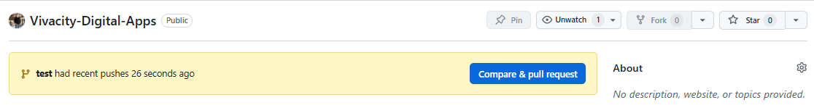
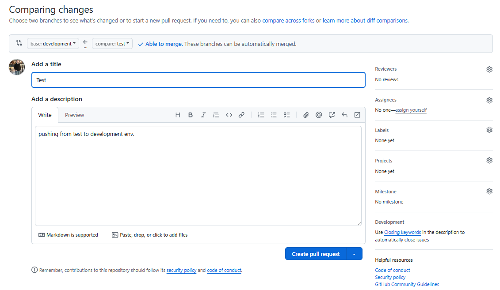
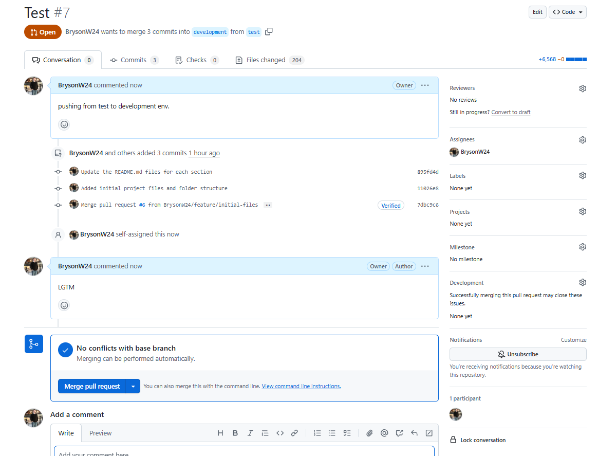
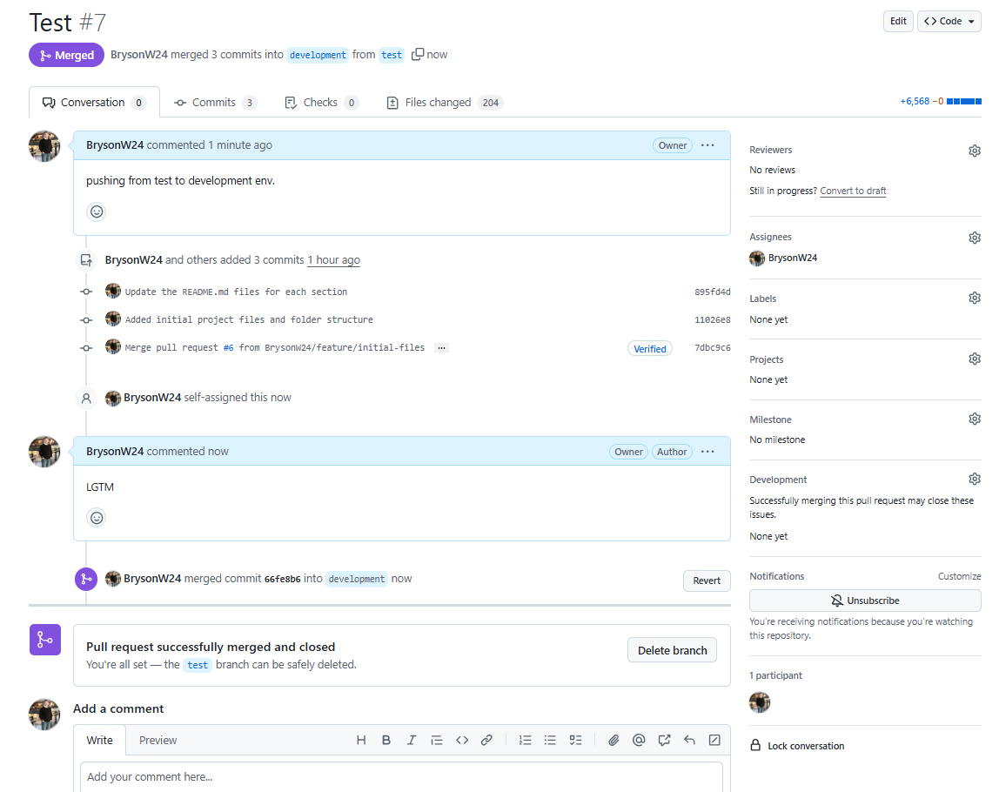
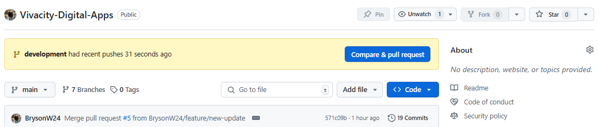
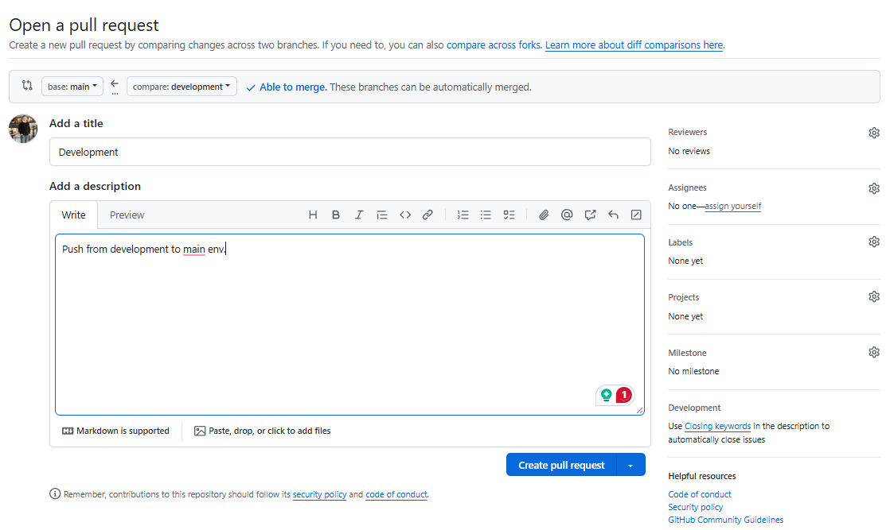
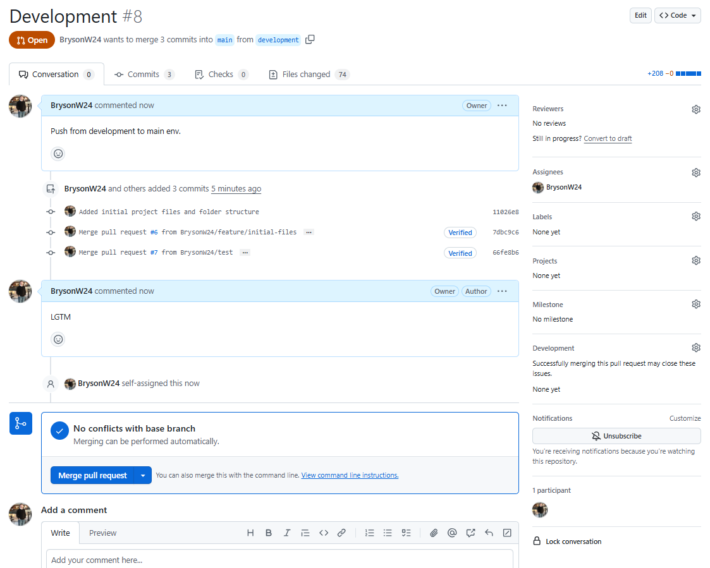
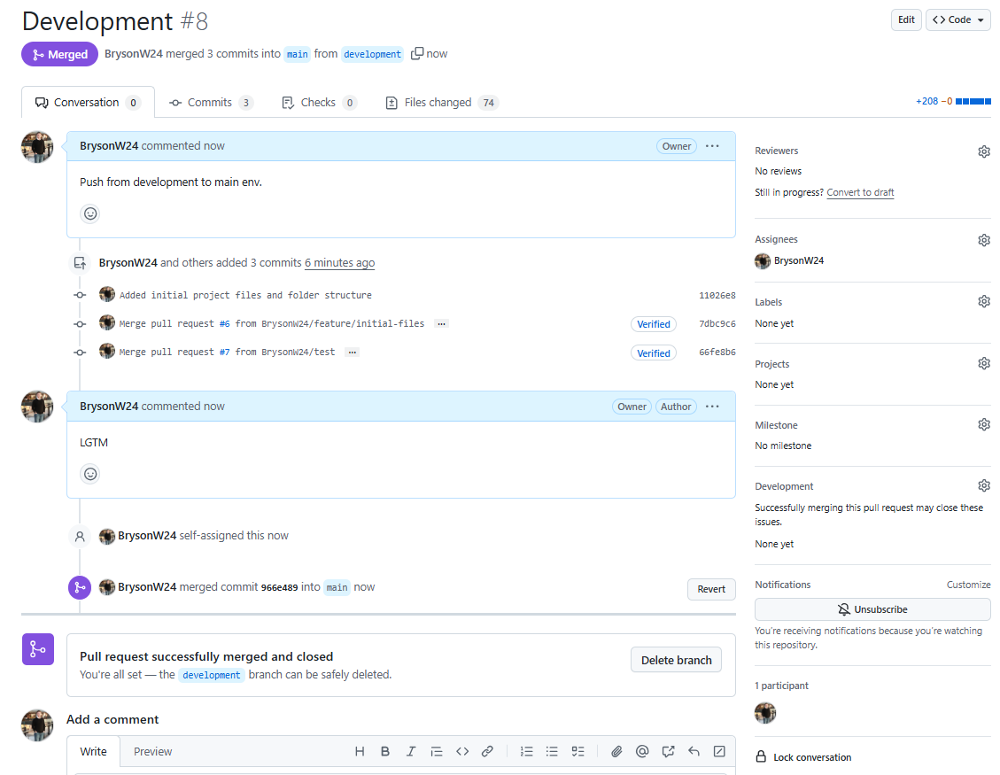

# Git Branching Strategy - Vivacity Digital Apps

## 📌 Overview
This document outlines the **Git branching strategy** for Vivacity Digital Apps. It explains the purpose of each branch, when to create and merge branches, and how to maintain a structured workflow for **solo development and scaling to teams**.

# 🔥 Logical & Standard Git Branching Strategy
This ensures clarity and prevents engineers from questioning the approach.

| **Branch**           | **Purpose** |
|----------------------|------------|
| `main`              | ✅ Production branch (stable, release-ready code). |
| `development`       | 🔄 Pre-production testing (fully tested, but not live yet). |
| `test`              | 🛠️ Feature integration branch (preliminary tests before development). |
| `feature/*`         | 👨‍💻 Feature branches for specific features (e.g., `feature/user-auth`). |
| `bugfix/*`          | 🐞 Minor bug fixes (merged into `test` → `development`). |
| `hotfix/*`          | 🚨 Critical production fixes (merged directly into `main`). |
| `release/checks`    | ✅ Final QA before pushing to `main`. |

## 🔄 Intended Workflow & Branch Flow
The **expected flow** for any new feature, bug fix, or update follows this structured approach:

1. **Create a feature or bugfix branch** from `test`
2. Develop and test the feature locally
3. Push the branch to GitHub and create a **Pull Request** into `test`
4. Once tested and reviewed, merge the changes into `test`
5. Regularly sync `development` with `test` for broader testing
6. Once the feature is stable, merge `test` into `development`
7. After final testing in `development`, merge into `main`
8. Clean up by **deleting the feature or bugfix branch locally and remotely**

## 📂 Branch Structure & Purpose
Below is the structured branch hierarchy used in this repository:

```
main                # Stable, production-ready code
│
development         # Active working branch (merged before main)
│
test               # Pre-development testing environment
│
├── feature/xyz     # New features under development
│
├── bugfix/xyz      # Fixes for non-critical bugs
│
├── hotfix/xyz      # Urgent fixes for production
│
└── release/xyz     # Pre-release branch for testing
```

---

## **✅ Expected Workflow for a New Feature**
1️⃣ **Start from `test` (our controlled test environment)**  
   ```bash
   git checkout test
   ```

2️⃣ **Create a new feature branch for the specific task**  
   ```bash
   git checkout -b feature/initial-files
   ```

3️⃣ **Add changes, commit, and push the feature branch**  
   ```bash
   git add .
   git commit -m "Added initial project files and folder structure"
   git push origin feature/initial-files
   ```

4️⃣ **Open a Pull Request (PR) from `feature/initial-files` → `test`**
   - Navigate to **GitHub → Pull Requests**.
   - Open a PR **from `feature/initial-files` into `test`**.
   - Once reviewed, **merge it into `test`**.

5️⃣ **Merge `test` into `development`**
   - Open another **PR from `test` into `development`**.
   - This ensures the feature has passed preliminary testing.

Step 1:


Step 2:


Step 3:


Step 4: 


6️⃣ **Merge `development` into `main`**
   - Once fully validated, **merge `development` into `main`**.
   - This finalizes the feature in production.

Step 1:


Step 2:


Step 3:


Step 4:


7️⃣ **Delete the feature branch after merging**
   - Locally:
     ```bash
     git branch -d feature/initial-files
     ```
   - Remotely:
     ```bash
     git push origin --delete feature/initial-files
     ```

---

### **🔹 `main` - Stable Production Code**
✅ **Purpose:**
- This branch contains the latest **stable, production-ready code**.
- **Only tested, reviewed, and approved** changes should be merged here.

🚀 **When to update?**
- After testing and approval from the `development` branch.
- Only merge using **pull requests** to prevent accidental overwrites.

📌 **Commands:**
```bash
git checkout main
git merge development
git push origin main
```

---

### **🔸 `development` - Active Development Branch**
❌ **Not Stable (Work in Progress)**

✅ **Purpose:**
- This branch is where **active development** happens.
- Feature branches merge here before being finalized.

🚀 **When to update?**
- Regularly merged from `test` after testing.
- Periodically synced with `main` to stay up to date.

📌 **Commands:**
```bash
git checkout development
git pull origin development
git merge test
git push origin development
```

---

### **🧪 `test` - Pre-Development Testing**
✅ **Purpose:**
- Acts as an intermediary testing phase before merging into `development`.
- Ensures **feature branches and bugfixes are stable** before wider development use.

🚀 **When to update?**
- Feature branches and bugfix branches merge into `test` first.
- Merges into `development` after approval.

📌 **Commands:**
```bash
git checkout test
git merge feature/new-feature
git push origin test
```

🔄 **Merging to development:**
```bash
git checkout development
git merge test
git push origin development
```

---

### **🛠 `feature/*` - Feature Development**
✅ **Purpose:**
- **Every new feature gets its own branch.**
- Keeps development organized and modular.

🚀 **When to create?**
- Whenever developing a new feature.
- Named as `feature/feature-name`.

📌 **Commands:**
```bash
git checkout -b feature/new-feature test
# Work on the feature
git commit -m "feat: added login functionality"
git push origin feature/new-feature
```

🔄 **Merging to test:**
```bash
git checkout test
git merge feature/new-feature
git push origin test
```

🧹 **After merging:**
```bash
git branch -d feature/new-feature
git push origin --delete feature/new-feature
```

---

### **🐛 `bugfix/*` - Fixing Bugs**
✅ **Purpose:**
- Used for **fixing non-critical bugs** found in development.
- **Not urgent** (hotfix branch is used for production bugs).

📌 **Commands:**
```bash
git checkout -b bugfix/fix-login test
# Fix the issue
git commit -m "fix: resolved login bug"
git push origin bugfix/fix-login
```

🔄 **Merging:**
```bash
git checkout test
git merge bugfix/fix-login
git push origin test
```

---

### **🔥 `hotfix/*` - Urgent Fixes for Production**
✅ **Purpose:**
- **Critical bug fixes** that need immediate action.
- **Created from `main` and merged back ASAP.**

📌 **Commands:**
```bash
git checkout -b hotfix/urgent-bug main
# Fix the issue
git commit -m "hotfix: urgent fix for production crash"
git push origin hotfix/urgent-bug
```

🔄 **Merging:**
```bash
git checkout main
git merge hotfix/urgent-bug
git push origin main
git checkout development
git merge main
git push origin development
```

---

### **🚀 `release/*` - Pre-Production Testing**
✅ **Purpose:**
- Used for **final testing** before merging into `main`.
- Stabilizes the code before production deployment.

📌 **Commands:**
```bash
git checkout -b release/v1.0 test
# Conduct testing & bug fixes
git commit -m "chore: final tests before release"
git push origin release/v1.0
```

🔄 **Merging:**
```bash
git checkout main
git merge release/v1.0
git push origin main
```

---

## 🚀 Future Roadmap
✅ Document branch workflows clearly
✅ Maintain structured feature and bugfix branches
🔜 Automate branch cleanup scripts
🔜 Introduce GitHub Actions for release automation

---

## 📌 FAQs
**1️⃣ Will the README automatically update across branches?**  
No, when you commit this README to `main`, other branches **will not automatically get the update**. You need to manually merge or rebase it.

**2️⃣ Can I skip using `test` branches?**  
No, `test` acts as a quality control phase before merging into `development`.

**3️⃣ Should I commit directly to `main`?**  
❌ **No.** Always commit to a feature branch, merge into `test`, then `development`, and finally into `main`.

---

## 📞 Need Help?
If you have any questions regarding Git branching, refer to this **README.md** or contact the repository maintainer.

🎯 **Keep your workflow clean, organized, and efficient! 🚀🔥**

